<div align="center">

# Docket

### A free, open-source shelf for the macOS Dock.

Live widgets, app groups and folders in a strip that sits beside Apple's Dock,
or stands in for it.

[](#build-from-source)
[](project.yml)
[](https://github.com/nparashar150/docket/releases)
[](.github/workflows/ci.yml)
[](#tests)
[](LICENSE)

<br>


<sub>A real shelf, running. System activity, an hourly forecast and a note on the
left, apps on the right, sized and placed from the real Dock's own settings.</sub>

</div>

---

## Standing on Dockset's shoulders

Docket exists because of **[Dockset](https://dockset.app)**, a genuinely lovely
macOS app built and sold by an independent developer. Dockset is the original:
it is the app that worked out what a Dock shelf should feel like, and it is
polished, supported and worth paying for. **If you want the real article, go and
buy it.** That is the version with a person behind it who will answer your email.

Docket is an independent reimplementation, written from scratch as a homage and
a way of learning how something like this is actually built. It is a hobby
project with rough edges. It is **not affiliated with, endorsed by, sponsored by
or connected to Dockset**, it is not "the free version" of it, and it is not
trying to replace or compete with it. No Dockset code, artwork, screenshots,
copy or branding is used here.

The full attribution, including the two specific design decisions this project
learned by looking at Dockset, is in **[NOTICE.md](NOTICE.md)**.

---

## A closer look

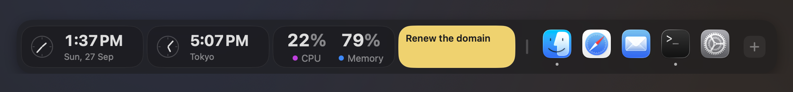

Widgets, then the grip that resizes the shelf, then apps. Every widget in this
shot is a live reading taken at the moment of capture.

## Panels

Click a widget and a panel opens, anchored to the tile it came from with a tail
pointing back at it. Twenty-three of the twenty-four widget kinds have one.
Dismiss with a click outside, Escape, or Command-W.

Every panel below is a real view of the real thing, not a mockup. Each caption
says what its panel is showing, and says so plainly where that is the widget
library's sample data rather than a live reading.

<table>
  <tr>
    <td width="33%" valign="top">
      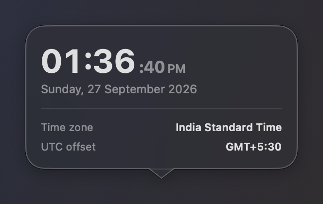<br>
      <sub><b>Clock</b><br>Live. This machine's own clock, its time zone and the day's date.</sub>
    </td>
    <td width="33%" valign="top">
      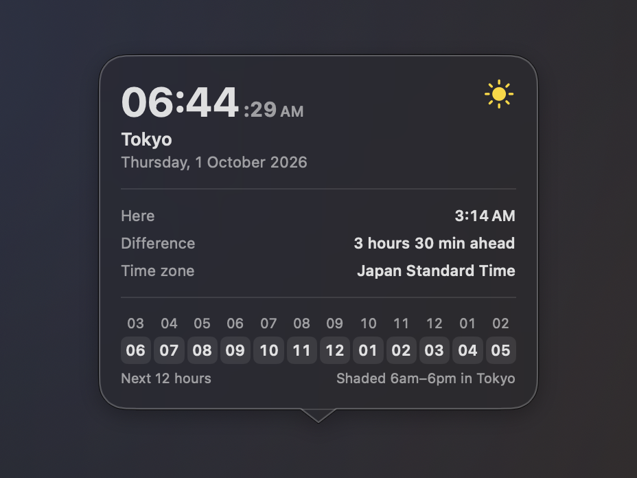<br>
      <sub><b>World Clock</b><br>Live. The real overlap between here and Tokyo, worked out by the zone's own rules.</sub>
    </td>
    <td width="33%" valign="top">
      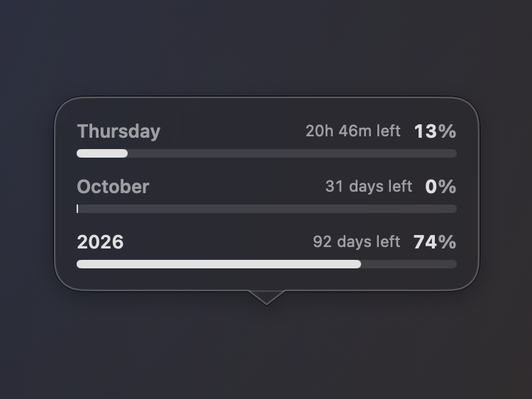<br>
      <sub><b>Time Progress</b><br>Live. How far through the day, the month and the year it had got by then.</sub>
    </td>
  </tr>
  <tr>
    <td valign="top">
      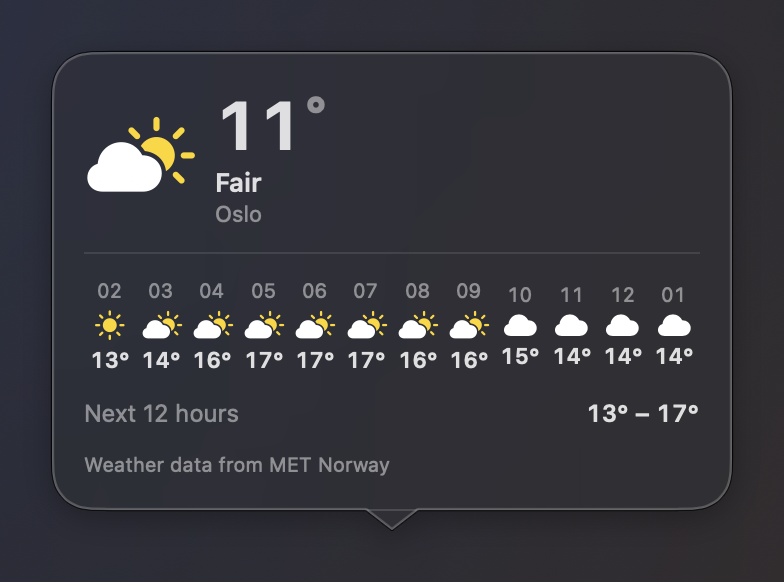<br>
      <sub><b>Weather</b><br>Live. A real MET Norway forecast for Oslo, hour by hour for twelve hours.</sub>
    </td>
    <td valign="top">
      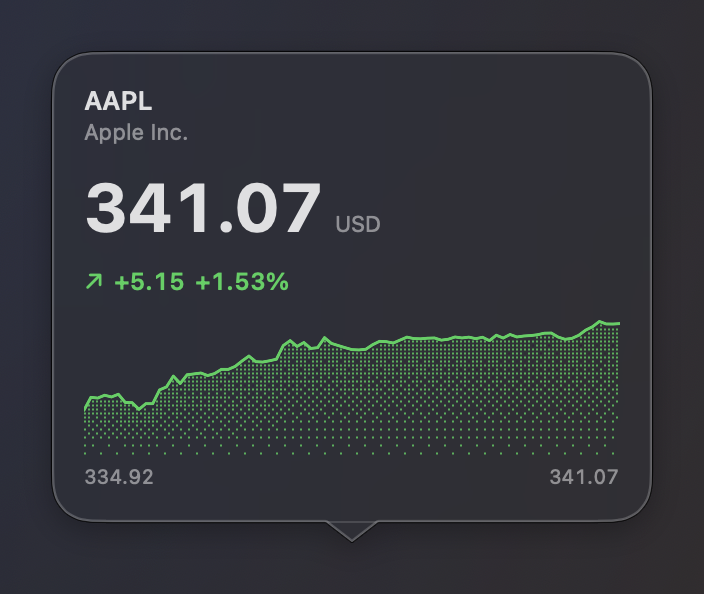<br>
      <sub><b>Stock</b><br>Live. A real quote, fetched from the network when the panel opened.</sub>
    </td>
    <td valign="top">
      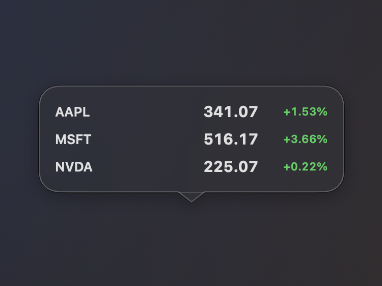<br>
      <sub><b>Watchlist</b><br>Live. Several symbols read off the same single fetch, shown as one list.</sub>
    </td>
  </tr>
  <tr>
    <td valign="top">
      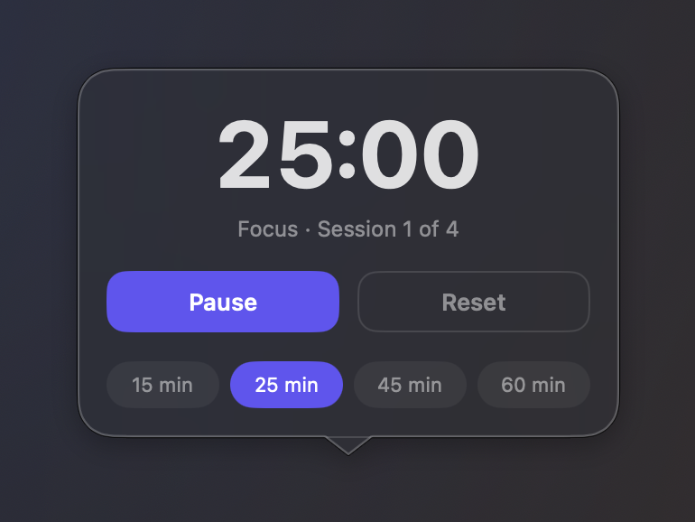<br>
      <sub><b>Focus Timer</b><br>Live, and genuinely running. Start it and stop it from the panel itself.</sub>
    </td>
    <td valign="top">
      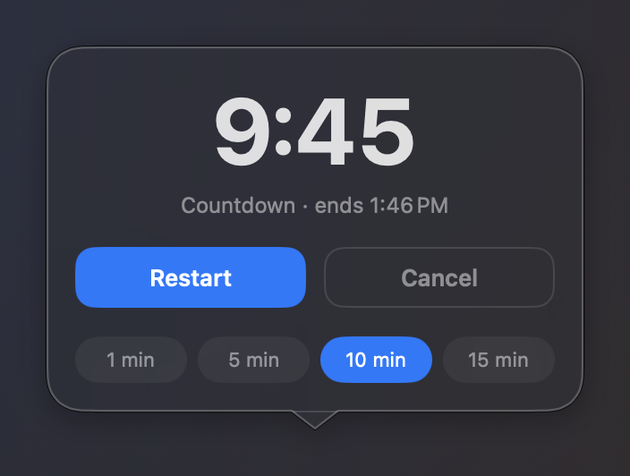<br>
      <sub><b>Countdown</b><br>Live. A real deadline, with the time left counted against the clock.</sub>
    </td>
    <td valign="top">
      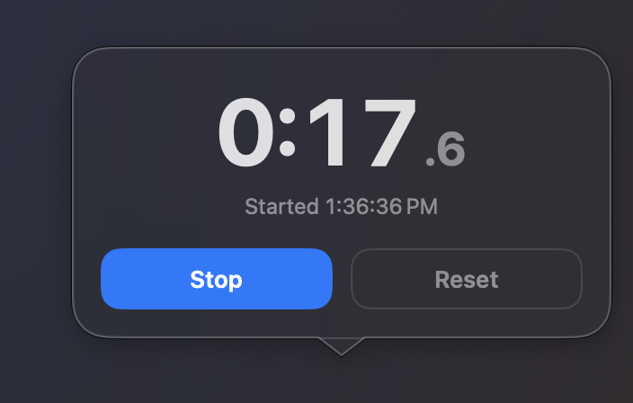<br>
      <sub><b>Stopwatch</b><br>Live and running. The elapsed figure is real, not a posed number.</sub>
    </td>
  </tr>
  <tr>
    <td valign="top">
      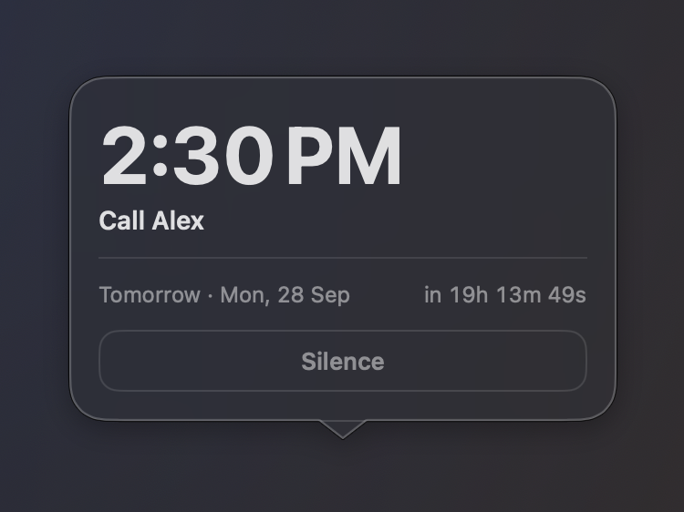<br>
      <sub><b>Alarm</b><br>Live. The time remaining is computed against the real system clock.</sub>
    </td>
    <td valign="top">
      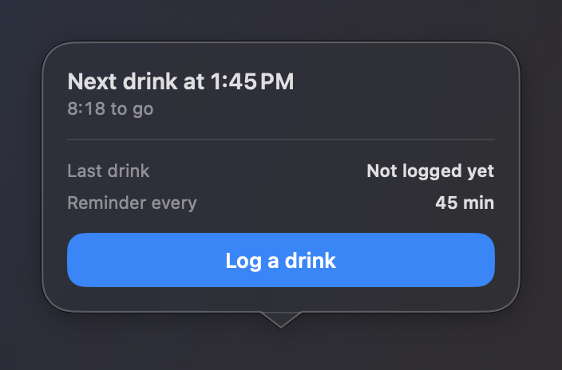<br>
      <sub><b>Hydration</b><br>Live, with nothing logged yet, which is the state a new widget sits in.</sub>
    </td>
    <td valign="top">
      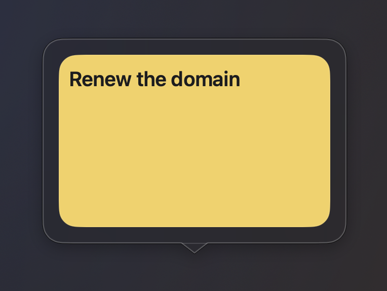<br>
      <sub><b>Sticky Note</b><br>Typed in place. The words are the widget's own content, not a reading.</sub>
    </td>
  </tr>
  <tr>
    <td valign="top">
      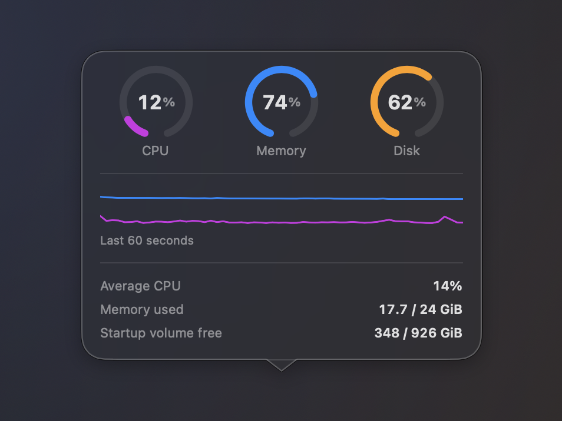<br>
      <sub><b>System Activity</b><br>Live CPU, memory and disk, with the graph a genuinely sampled minute.</sub>
    </td>
    <td valign="top">
      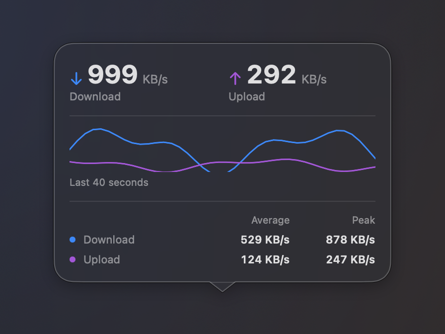<br>
      <sub><b>Network Activity</b><br><i>Sample data.</i> The sampler is real, but an idle machine draws a flat line that shows nothing.</sub>
    </td>
    <td valign="top">
      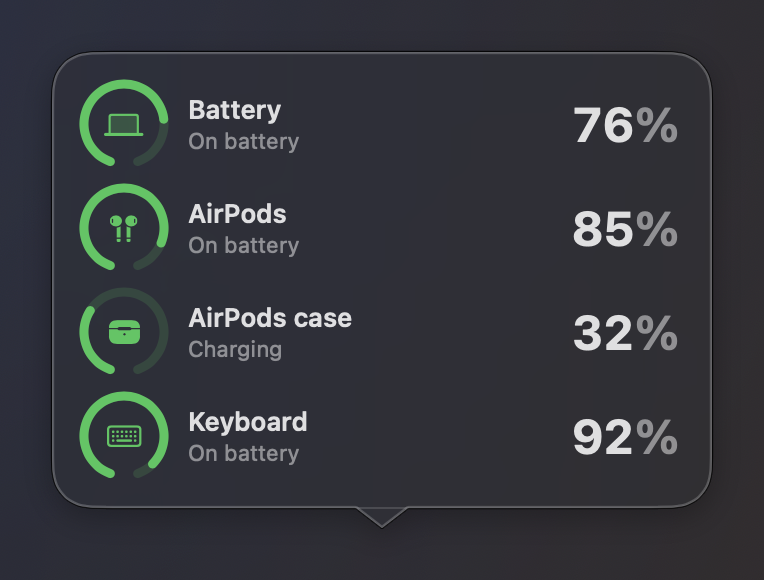<br>
      <sub><b>Battery</b><br><i>Sample data.</i> A live read would list this machine's own accessories by name.</sub>
    </td>
  </tr>
  <tr>
    <td valign="top">
      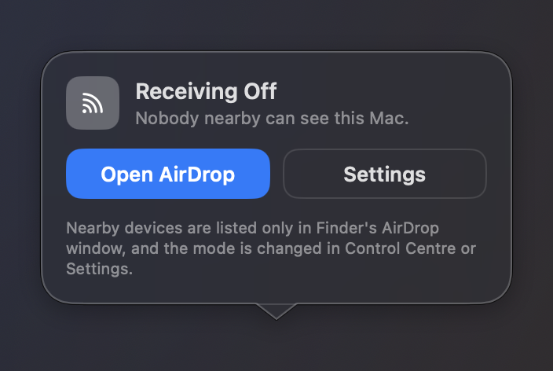<br>
      <sub><b>AirDrop</b><br>Live. Read straight from <code>sharingd</code>'s own discoverability setting.</sub>
    </td>
    <td valign="top">
      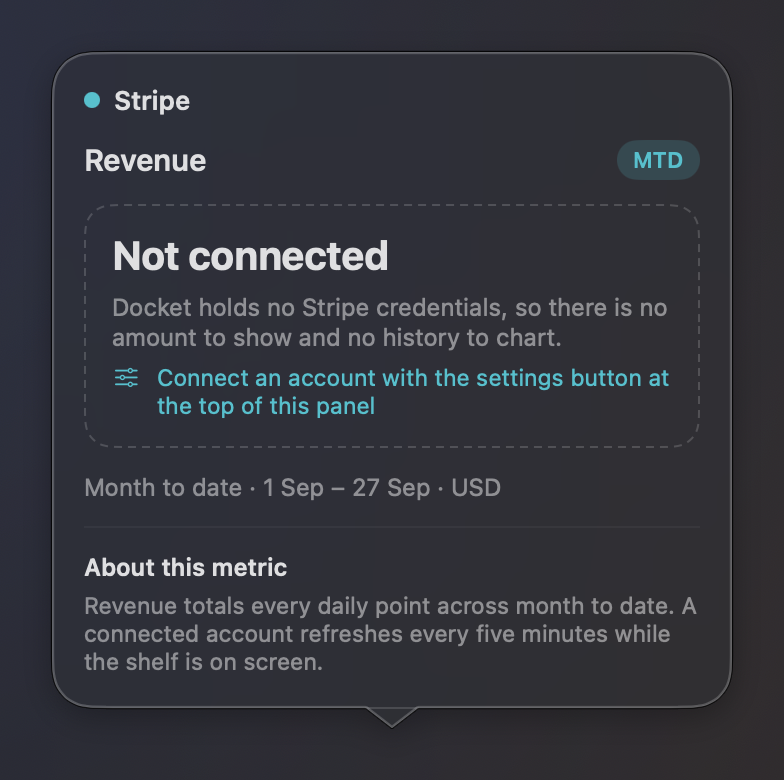<br>
      <sub><b>Stripe</b><br>The empty state, on purpose. This build ships no client, so it says so. See <a href="#known-limits">Known limits</a>.</sub>
    </td>
  </tr>
</table>

<sub>Calendar, Reminders and Now Playing have full panels in the app and are not
pictured here. All three need a consent grant that belongs to a bundled app, and
the capture tool is not one, so their panels would show a permission line and
nothing else.</sub>

---

## What it does

- **Follows your real Dock instead of copying it.** Size, edge, magnification
  and auto-hide are read live from `com.apple.dock`, and the shelf subscribes to
  the `com.apple.dock.prefchanged` notification the Dock posts when any of them
  change. Drag the size slider in System Settings and the shelf moves with it.
  Pinned apps are mirrored the same way. Resize the shelf by dragging and only
  the *size* stops following; the edge and the hiding still do.
- **Twenty-four widget kinds**, twenty of which draw a live tile today: clock,
  world clock, stopwatch, focus timer, time progress, countdown, alarm,
  hydration, sticky notes, calendar, reminders, battery, system activity,
  network, AirDrop, stocks, watchlist, weather, Shortcut and Now Playing.
  Twenty-three open a detail panel. They are usable, not just readable:
  timers start and stop, notes are typed in place, the alarm toggles, a
  shortcut runs, and the metric and symbol tiles page through what they show.
- **App groups.** Drop one icon onto another and hold, the way iOS makes a
  folder. Tinted, named, with a 2x2 preview grid in a single Dock slot, opening
  into a panel you can drag icons back out of. A group left holding one item
  gives way to that icon.
- **And the rest.** Overflow scrolling with the trackpad, drag to reorder
  anywhere in the row, the launch bounce, folders and files alongside apps, and
  saved layouts that can be written back to Apple's real Dock: only
  `persistent-apps`, never your stacks or recents, with verification and a
  rollback if the Dock comes back wrong.

<details>
<summary><b>Two decisions that were not obvious</b></summary>

<br>

**Magnification uses Apple's own curve.** `Geometry.influence` is a raised-cosine
falloff, `(1 + cos(πd/r)) / 2`: 1.0 under the pointer, 0 at the radius, and, the
part that matters, zero slope at *both* ends, so there is no visible seam where
the effect stops. A linear ramp makes neighbours lurch as the pointer crosses
them. A gaussian never quite reaches zero, so icons three tiles away drift for no
reason. Peak and radius come from your own `largesize` and `tilesize` rather than
from a constant.

**Now Playing scripts the players, because the framework is gated.** The obvious
route is `MediaRemote`, and it has been entitlement-gated since macOS 15.4: it
loads, the symbols resolve, and it returns nothing to an unsigned caller. So
Docket asks the players directly over Apple Events. Spotify and Apple Music
first, then whatever a scriptable browser tab is playing (Safari, Brave, Helium
and Dia; Firefox ships no scripting dictionary at all, so there is nothing there
to address). Browsers are addressed by bundle identifier, never by name, because
`application "Brave Browser"` can resolve to a fork that inherited the
LaunchServices name. Nothing here ever launches a player: an app that is not
already running is skipped.

</details>

---

## Install

Grab the latest `.zip` from the
[Releases page](https://github.com/nparashar150/docket/releases), unzip it and
move `Docket.app` to `/Applications`.

**Builds are unsigned and not notarised**, because notarisation needs a paid
Apple Developer account. macOS 26 will refuse the first launch with a dialog
saying it cannot verify the app is free of malware. The way through:

1. Double-click the app, get the refusal, dismiss it.
2. **System Settings > Privacy & Security > Security**, where there is now an
   **Open Anyway** button for Docket.
3. Click it, authenticate, launch again and confirm.

Control-click > Open stopped working for this in Sequoia and is not the route on
macOS 26. From a terminal instead:
`xattr -dr com.apple.quarantine /Applications/Docket.app`.

**On first run, look up.** Docket is an `LSUIElement` accessory app: no Dock tile
and no window of its own. Its only permanent UI is the status item in the menu
bar, which is where settings, the widget library and the profile switcher live.

### Build from source

Requires macOS 26 and Xcode. The Xcode project is generated from `project.yml`
and is not in the tree:

```sh
brew install xcodegen
xcodegen generate
xcodebuild -scheme Docket -configuration Release build
```

`project.yml` pins a specific signing identity and team. Replace
`CODE_SIGN_IDENTITY` and `DEVELOPMENT_TEAM` with your own, or build ad-hoc with
`CODE_SIGN_IDENTITY: "-"`, noting that macOS will not offer location consent to
an ad-hoc binary at all, because there is no stable identity to attach the grant
to. [CONTRIBUTING.md](CONTRIBUTING.md) has the details.

---

## Tests

**326 tests, and almost all of them exist because something broke.**

```sh
xcodegen generate
xcodebuild -scheme DocketTests -configuration Debug test
```

The coordinate conversions have the most coverage, because that was the most
repeated defect: the shelf sits centred inside a panel longer than itself, and
converting between a screen position and a position along the row needs that
inset. The hover label pointed at the wrong icon, then the drop gap opened away
from the pointer, then the two drifted apart again. The suite asserts the round
trip, so a slot centre taken out and brought back must return that slot.

`InteractionTests` deliver real `NSEvent`s to a window. The worst defects there
were all "the click never arrived", and none were visible in the layout maths: an
empty content shape removed every widget's controls from hit testing, a
borderless panel could not take a keystroke, and a non-key window swallowed the
first press. No assertion on a value catches any of that.

<details>
<summary><b>How the source is laid out</b></summary>

<br>

```
Sources/
  App/         AppState, the single source of truth: persisted state, the one
               1s tick every time-based widget reads, and the only path that
               writes Apple's Dock. Plus the entry point and window owners.
  Core/        Pure value types and maths. Geometry (layout, magnification,
               springs), Models, Persistence, and the Dock tile encoding. No
               AppKit state, so it is the part the tests compile directly.
  DockPanel/   The shelf: the NSPanel and its controller, the SwiftUI row,
               tiles, drag and drop, group windows, tooltips, the vibrancy
               background, and the scroll relay.
  Widgets/     The catalog, the tile for each kind (Kinds/), the detail panel
               for each kind (Details/), and the shared chrome.
  Services/    Everything that talks outward: system metrics, battery, network,
               weather, stocks, music, browsers, the app catalog, location, and
               the com.apple.dock reader.
  MenuBar/     The status item, its menu, and the settings surfaces.
  NativeDock/  The actor that reads and writes Apple's real Dock.
```

How a click on a widget reaches its panel:

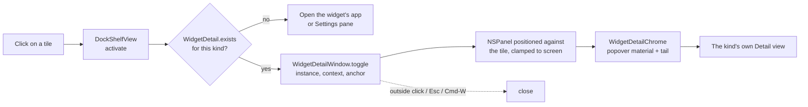

One structural rule worth knowing: types that need testing live in files the
test target compiles. `DocketTests` builds `Sources/Core` plus four named files
rather than hosting the app, which is why `KeyablePanel` lives in
`DockLayout.swift`. A break in `Sources/App`, `Sources/Widgets` or
`Sources/DockPanel` will never reach the suite, so CI builds the app and runs the
tests as two separate steps.

</details>

---

## Known limits

- **Four widget kinds cannot be added.** AI usage, Stripe, Paddle and Shopify
  are declared kinds the library does not offer, so none of them can be put on
  a shelf in this build. Stripe, Paddle and Shopify do have working detail
  panels behind them; AI usage does not. All four fall back to a labelled
  "not yet" tile, which nothing currently reaches.
- **The revenue widgets have no service behind them.** Stripe, Paddle and Shopify
  are all network-backed and this build ships no client for any of them. Their
  panel deliberately states that it is unconnected rather than drawing a
  plausible figure. A made-up amount under a real account name is
  indistinguishable from a working widget, and that is the one failure a money
  readout cannot afford. The panel pictured above is that empty state.
- **Location consent is not reachable.** The weather widget asks CoreLocation for
  your city; macOS does not present the prompt to an accessory app with no
  ordinary window, and promoting the app to `.regular` first, which is what makes
  the Apple Events prompt appear, does not change it. Set a city in
  Settings > Widgets instead.
- **Apple Events need consent.** Reading Spotify, Music or a browser tab requires
  approving Docket under Privacy & Security > Automation, and the browser
  fallback additionally needs "Allow JavaScript from Apple Events" in that
  browser's Develop menu.
- **Removal uses a deprecated API on purpose.** `NSAnimationEffect` is the Dock's
  own poof, and Apple withdrew it suggesting a *cursor* as the replacement. It
  still renders, and a real poof beats a hand-drawn puff of smoke.
- **Builds are unsigned.** Every download walks the Privacy & Security path
  above. Building from source with your own certificate is the way around it.

---

## Contributing

Bug reports and pull requests are welcome. [CONTRIBUTING.md](CONTRIBUTING.md)
covers the build, the signing situation, what the test target can and cannot
see, and the house rules, the main one being that comments explain *why*, never
*what*.

## Credits

- **[Dockset](https://dockset.app)**, the original, and the reason this exists.
  Please go and buy it. Full attribution in [NOTICE.md](NOTICE.md).
- Weather data from **[MET Norway](https://api.met.no/)**, used under CC BY 4.0.
- Built with **[XcodeGen](https://github.com/yonaskolb/XcodeGen)**.
- No bundled dependencies. Everything else is Apple's own frameworks.

## Licence

[MIT](LICENSE). Third-party attributions and trademark notices are in
[NOTICE.md](NOTICE.md).
